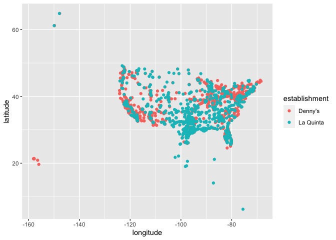

Lab 04 - La Quinta is Spanish for next to Denny’s, Pt. 1
================
Marq Schieber
2/27/2022

### Load packages and data

``` r
library(tidyverse) 
```

    ## Warning: package 'tidyr' was built under R version 4.0.5

    ## Warning: package 'readr' was built under R version 4.0.5

    ## Warning: package 'dplyr' was built under R version 4.0.5

``` r
library(dsbox) 
```

``` r
states <- read_csv("data/states.csv")
```

### Exercise 1

What are the dimensions of the Denny’s dataset? (Hint: Use inline R code
and functions like nrow and ncol to compose your answer.) What does each
row in the dataset represent? What are the variables?

Dimensions: 1643 rwos by 6 collumns. The variables include: address,
city, latitude, longitude, state and zip. Each row is a different
Denny’s location.

``` r
nrow(dennys)
```

    ## [1] 1643

``` r
ncol(dennys)
```

    ## [1] 6

``` r
ls(dennys)
```

    ## [1] "address"   "city"      "latitude"  "longitude" "state"     "zip"

### Exercise 2

What are the dimensions of the La Quinta’s dataset? What does each row
in the dataset represent? What are the variables?

Dimensions: 909 by 6 Rows: La Quinta Locations Variables: address, city,
latitude, longitude, state and zip

``` r
nrow(laquinta)
```

    ## [1] 909

``` r
ncol(laquinta)
```

    ## [1] 6

``` r
ls(laquinta)
```

    ## [1] "address"   "city"      "latitude"  "longitude" "state"     "zip"

### Exercise 3

Take a look at the websites that the data come from (linked above). Are
there any La Quinta’s locations outside of the US? If so, which
countries? What about Denny’s?

No Denny’s are found abroad.

La Quinta can be found outside the US in: Canada, Mexico, China, New
Zealand, Honduras, Turkey, UAE, Chile and Colombia.

…

### Exercise 4

Brainstorming: You could filter by state. Any non-US states are abroad.

### Exercise 5

``` r
dennys %>%
  filter(!(state %in% states$abbreviation))
```

    ## # A tibble: 0 × 6
    ## # … with 6 variables: address <chr>, city <chr>, state <chr>, zip <chr>,
    ## #   longitude <dbl>, latitude <dbl>

0 locations

### Exercise 6

``` r
dennys %>%
  mutate(country = "United States")
```

    ## # A tibble: 1,643 × 7
    ##    address                        city    state zip   longitude latitude country
    ##    <chr>                          <chr>   <chr> <chr>     <dbl>    <dbl> <chr>  
    ##  1 2900 Denali                    Anchor… AK    99503    -150.      61.2 United…
    ##  2 3850 Debarr Road               Anchor… AK    99508    -150.      61.2 United…
    ##  3 1929 Airport Way               Fairba… AK    99701    -148.      64.8 United…
    ##  4 230 Connector Dr               Auburn  AL    36849     -85.5     32.6 United…
    ##  5 224 Daniel Payne Drive N       Birmin… AL    35207     -86.8     33.6 United…
    ##  6 900 16th St S, Commons on Gree Birmin… AL    35294     -86.8     33.5 United…
    ##  7 5931 Alabama Highway, #157     Cullman AL    35056     -86.9     34.2 United…
    ##  8 2190 Ross Clark Circle         Dothan  AL    36301     -85.4     31.2 United…
    ##  9 900 Tyson Rd                   Hope H… AL    36043     -86.4     32.2 United…
    ## 10 4874 University Drive          Huntsv… AL    35816     -86.7     34.7 United…
    ## # … with 1,633 more rows

### Exercise 7

``` r
laquinta %>%
  filter(!(state %in% states$abbreviation))
```

    ## # A tibble: 14 × 6
    ##    address                                  city  state zip   longitude latitude
    ##    <chr>                                    <chr> <chr> <chr>     <dbl>    <dbl>
    ##  1 Carretera Panamericana Sur KM 12         "\nA… AG    20345    -102.     21.8 
    ##  2 Av. Tulum Mza. 14 S.M. 4 Lote 2          "\nC… QR    77500     -86.8    21.2 
    ##  3 Ejercito Nacional 8211                   "Col… CH    32528    -106.     31.7 
    ##  4 Blvd. Aeropuerto 4001                    "Par… NL    66600    -100.     25.8 
    ##  5 Carrera 38 # 26-13 Avenida las Palmas c… "\nM… ANT   0500…     -75.6     6.22
    ##  6 AV. PINO SUAREZ No. 1001                 "Col… NL    64000    -100.     25.7 
    ##  7 Av. Fidel Velazquez #3000 Col. Central   "\nM… NL    64190    -100.     25.7 
    ##  8 63 King Street East                      "\nO… ON    L1H1…     -78.9    43.9 
    ##  9 Calle Las Torres-1 Colonia Reforma       "\nP… VE    93210     -97.4    20.6 
    ## 10 Blvd. Audi N. 3 Ciudad Modelo            "\nS… PU    75010     -97.8    19.2 
    ## 11 Ave. Zeta del Cochero No 407             "Col… PU    72810     -98.2    19.0 
    ## 12 Av. Benito Juarez 1230 B (Carretera 57)… "\nS… SL    78399    -101.     22.1 
    ## 13 Blvd. Fuerza Armadas                     "con… FM    11101     -87.2    14.1 
    ## 14 8640 Alexandra Rd                        "\nR… BC    V6X1…    -123.     49.2

### Exercise 8

``` r
laquinta %>%
  mutate(country = case_when(
    state %in% states$abbreviation ~ "United States",
    state %in% c("ON", "BC") ~ "Canada",
    state == "ANT"           ~ "Colombia",
    state == "FM" ~"Honduras",
    state %in% c("AG" , "QR" , "CH" , "NL" , "VE" , "PU" , "SL") ~ "Mexico"
  )) %>%
  filter(country == "United States")
```

    ## # A tibble: 895 × 7
    ##    address                         city   state zip   longitude latitude country
    ##    <chr>                           <chr>  <chr> <chr>     <dbl>    <dbl> <chr>  
    ##  1 793 W. Bel Air Avenue           "\nAb… MD    21001     -76.2     39.5 United…
    ##  2 3018 CatClaw Dr                 "\nAb… TX    79606     -99.8     32.4 United…
    ##  3 3501 West Lake Rd               "\nAb… TX    79601     -99.7     32.5 United…
    ##  4 184 North Point Way             "\nAc… GA    30102     -84.7     34.1 United…
    ##  5 2828 East Arlington Street      "\nAd… OK    74820     -96.6     34.8 United…
    ##  6 14925 Landmark Blvd             "\nAd… TX    75254     -96.8     33.0 United…
    ##  7 909 East Frontage Rd            "\nAl… TX    78516     -98.1     26.2 United…
    ##  8 2116 Yale Blvd Southeast        "\nAl… NM    87106    -107.      35.1 United…
    ##  9 7439 Pan American Fwy Northeast "\nAl… NM    87109    -107.      35.2 United…
    ## 10 2011 Menaul Blvd Northeast      "\nAl… NM    87107    -107.      35.1 United…
    ## # … with 885 more rows

### Exercise 9

``` r
dennys %>%
  count(state) %>%
  inner_join(states, by = c("state" = "abbreviation"))
```

    ## # A tibble: 51 × 4
    ##    state     n name                     area
    ##    <chr> <int> <chr>                   <dbl>
    ##  1 AK        3 Alaska               665384. 
    ##  2 AL        7 Alabama               52420. 
    ##  3 AR        9 Arkansas              53179. 
    ##  4 AZ       83 Arizona              113990. 
    ##  5 CA      403 California           163695. 
    ##  6 CO       29 Colorado             104094. 
    ##  7 CT       12 Connecticut            5543. 
    ##  8 DC        2 District of Columbia     68.3
    ##  9 DE        1 Delaware               2489. 
    ## 10 FL      140 Florida               65758. 
    ## # … with 41 more rows

``` r
laquinta %>%
  count(state) %>%
  inner_join(states, by = c("state" = "abbreviation"))
```

    ## # A tibble: 48 × 4
    ##    state     n name           area
    ##    <chr> <int> <chr>         <dbl>
    ##  1 AK        2 Alaska      665384.
    ##  2 AL       16 Alabama      52420.
    ##  3 AR       13 Arkansas     53179.
    ##  4 AZ       18 Arizona     113990.
    ##  5 CA       56 California  163695.
    ##  6 CO       27 Colorado    104094.
    ##  7 CT        6 Connecticut   5543.
    ##  8 FL       74 Florida      65758.
    ##  9 GA       41 Georgia      59425.
    ## 10 IA        4 Iowa         56273.
    ## # … with 38 more rows

### Exercise 10

It looks like California has the most Denny’s. Texas has the most
laquintas.

``` r
dennys <- dennys %>%
  mutate(establishment = "Denny's")
laquinta <- laquinta %>%
  mutate(establishment = "La Quinta")

dn_lq <- bind_rows(dennys, laquinta)

ggplot(dn_lq, mapping = aes(x = longitude, y = latitude, color = establishment)) +
  geom_point()
```

<!-- -->
